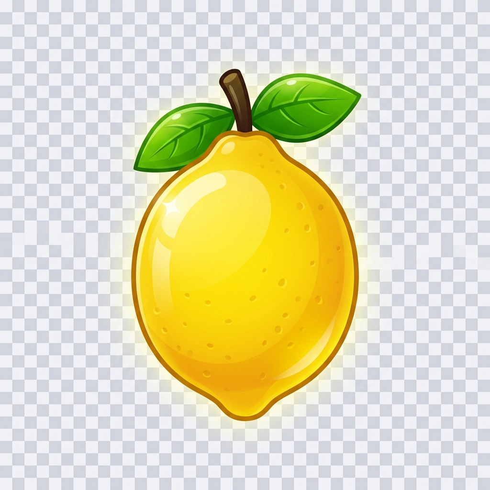

# Narenciye Kaptanı 🍋🍊

**Narenciye Kaptanı**, Mersin'in güneşli narenciye bahçelerinden ilham alan, modern ve akıcı bir HTML5 Match-3 web oyunudur.



## ✨ Proje Hakkında
Bu oyun, saf Vanilla JavaScript, HTML ve CSS kullanılarak geliştirildi. Amacımız, bağımlılık içermeyen, hafif ve görsel açıdan etkileyici bir tarayıcı oyunu sunmaktı.

## 🌟 Ana Özellikler
- **Glassmorphism Tasarım:** Şeffaf paneller, yumuşak gölgeler ve canlı renk geçişleri.
- **Çok Katmanlı Oyun Deneyimi:** Seviye ilerlemesi, skor hedefleri, bosses ve özel efektler.
- **Animasyonlu Efektler:** Partiküller, hedef vurguları, boss atmosferi ve daha fazlası.
- **Ayarlar Menüsü:** Ses seviyesi, müzik, efektler, görsel yoğunluk ve ipuçlarını kapatma/ açma seçenekleri.
- **Kanıtlanmış Match-3 Mantığı:** Tahta eşleştirme, bomba/roket gücü ve karışık durumlar için yeniden karıştırma.
- **Kolay Çalıştırma:** Ek yazılım veya sunucu gerektirmez — sadece bir tarayıcı yeter.

## 🚀 Nasıl Çalıştırılır
1. Bu depo içeriğini indirin veya klonlayın.
2. `index.html` dosyasını bir tarayıcıda açın.
3. Oyun menüsünden oynayın.

> Not: Oyun, modern tarayıcılarda en iyi performansı gösterir.

## 🕹️ Oynanış
- **Meyveleri değiştir:** Komşu iki meyveyi sürükleyerek eşleştirin.
- **Hedefe ulaş:** Her seviyenin kendi puan hedefi ve hamle limiti vardır.
- **Özel güçler topla:** Aynı anda daha fazla eşleştirme yaparak bomba, roket ve gökkuşağı etkileri kazan.
- **Boss savaşları:** Bazı seviyelerde sıradan eşleştirmeden daha fazlası beklenir.

## 📁 Proje Dosya Yapısı
```text
NARENCİYE/
├── assets/
│   └── images/          # Oyun içi görseller
├── css/
│   └── style.css        # Tüm stil ve ekran düzeni
├── js/
│   ├── config.js        # Seviye, araç ve genel sabit ayarlar
│   ├── engine.js        # Tahta mantığı, eşleştirme ve hareketler
│   ├── graphics.js      # Canvas çizimleri, partikül ve efekt sistemi
│   ├── state.js         # Global oyun durumu ve verileri
│   ├── ui.js            # Arayüz güncellemeleri, ayarlar ve ekran yönetimi
│   └── main.js          # Oyun döngüsü, olay bağlama ve temel akış
└── index.html           # Oyun ana iskeleti
```

## 🏆 Yarışma ve Proje Kökeni
Bu oyun, **"Geleceği Sen Yaz: Dijital Oyun Geliştirme Yarışması"** için özel olarak hazırlandı. Proje, Mersin'in narenciye temasını ve yerel kültürünü dijital bir yarışma deneyimine taşırken, aynı zamanda görsel ve oynanış odaklı bir sunum hedefliyor.

## 👨‍🎓 Proje Künye
- **Geliştirici:** Selahattin Sarıbay (11. Sınıf)
- **Öğrenci No:** 1308
- **Okul:** Yahya Günsur Mesleki ve Teknik Anadolu Lisesi
- **Danışman Öğretmen:** Zehra Abacı

Selahattin, okulunun vizyonunu yansıtan güçlü bir proje ortaya koydu. Tasarım anlayışı, kullanıcı deneyimine verdiği önem ve narenciye temalı yarışmaya uygun ortam yaratma konusundaki başarısı ile dikkat çekiyor.

## 🛠️ Geliştirme
- `js/config.js` dosyasından seviyeleri, hamle sayılarını ve hedef puanları değiştirebilirsiniz.
- `css/style.css` dosyası oyun temasını kişiselleştirmenize izin verir.
- `js/graphics.js` içindeki çizim fonksiyonları, oyunun görsel stilini kontrol eder.

## 💡 Neden Bu Proje?
- Bağımlılıksız ve hızlı.
- Kolayca genişletilebilir ve yenilenebilir.
- Hem masaüstü hem mobil tarayıcıda çalışır.
- Hazırda bulunan stil ve efektlerle etkileyici bir kullanıcı deneyimi sunar.

## 📌 Kullanım Amacı
- Portföy sunumu için ideal.
- Frontend / HTML5 oyun geliştirme örneği.
- JavaScript, Canvas, kullanıcı arayüzü ve oyun mantığı içeren bir mini proje.

## 📬 İletişim
Bu proje üzerinde çalışmaya devam etmek istiyorsanız, GitHub üzerinden paylaşabilir ve geri bildirimlerle geliştirebilirsiniz.

---

> `Narenciye Kaptanı`, narenciye bahçelerinin enerjisini dijital bir oyun deneyimine taşıyor. Keyifli oyunlar! 🍊
